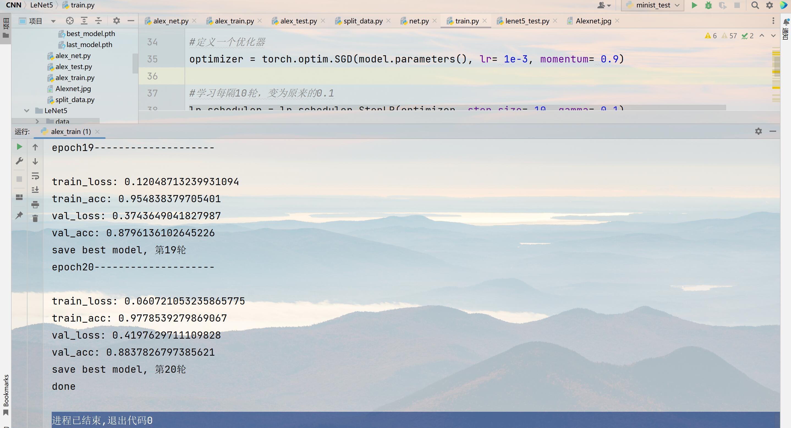

# 炼丹笔记

## 1基于Pytorch实现LeNet5和AlexNet

Pytorch是目前最流行深度学习框架，被广泛地应用在深度学习以及人工智能领域。LeNet5是称为是卷积神经网络CNN用于图像识别的开山之作，而AlexNet是让卷积神经网络大放异彩的模型，两个模型对于卷积神经网络具有非常重要的意义。本次使用Pytorch这一深度学习框架来实现LeNet5和AlexNet这两个模型。在最终实现的效果中，实现的LeNet5模型在测试集中最终的准确率为98.61%，实现的AlexNet模型在测试集中最终的准确率为88.38%，两个模型均实现了较高的准确率。

LeNet5:

AlexNet:

